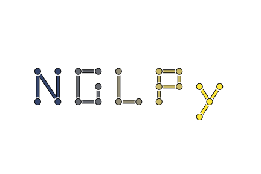

=====
nglpy
=====

.. badges

.. image:: https://img.shields.io/pypi/v/nglpy.svg
        :target: https://pypi.python.org/pypi/nglpy
        :alt: PyPi
.. image:: https://travis-ci.org/maljovec/nglpy.svg?branch=master
        :target: https://travis-ci.org/maljovec/nglpy
        :alt: Travis-CI
.. image:: https://coveralls.io/repos/github/maljovec/nglpy/badge.svg?branch=master
        :target: https://coveralls.io/github/maljovec/nglpy?branch=master
        :alt: Coveralls
.. image:: https://readthedocs.org/projects/nglpy/badge/?version=latest
        :target: https://nglpy.readthedocs.io/en/latest/?badge=latest
        :alt: ReadTheDocs
.. image:: https://pyup.io/repos/github/maljovec/nglpy/shield.svg
        :target: https://pyup.io/repos/github/maljovec/nglpy/
        :alt: Pyup

.. end_badges

.. logo

.. end_logo

.. introduction

A Python wrapped version of the [Neighborhood Graph Library
(NGL_) developed by Carlos Correa and Peter Lindstrom.

.. _NGL: http://www.ngraph.org/

.. LONG_DESCRIPTION

Given a set of arbitrarily arranged points in any dimension, this library is
able to construct several different types of neighborhood graphs mainly focusing
on empty region graph algorithms such as the beta skeleton family of graphs.

.. END_LONG_DESCRIPTION

.. end_introduction

.. install

Installation
============

::

    pip install nglpy

.. end-install

.. usage

Usage
=====

Then you can use the library from python such as the example below::

    import nglpy
    import numpy as np

    point_set = np.random.rand(100,2)
    max_neighbors = 9
    beta = 1

    aGraph = nglpy.EmptyRegionGraph(max_neighbors=max_neighbors, relaxed=False, beta=beta)
    aGraph.build(point_set)

    aGraph.neighbors()

.. end-usage
